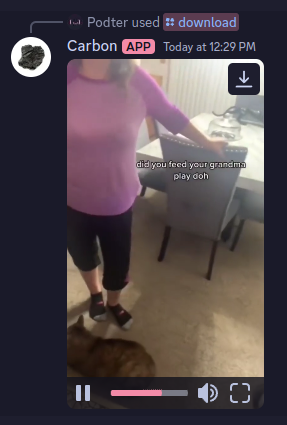

# Carbon

Carbon is a simple Discord bot that allows you to download video from the internet and send it to the channel.

The bot is hosted on Cloudflare Pages, so it's fast and serverless. Video download is done by [cobalt.tools](https://cobalt.tools/).



[Try it out!](https://discord.com/oauth2/authorize?client_id=1279199955424247808)

## Deployment

To deploy this project, just deploy regularly on Cloudflare Pages with the following secrets:

- `APPLICATION_ID` Discord application ID
- `PUBLIC_KEY` Discord application public key. Found in the app's general information page
- `TOKEN` Discord bot token
- `DEV_GUILD_ID` Discord server ID for development (optional)
- `COBALT_API` cobalt.tools API endpoint

You can check `example.dev.vars` for example values.

Then set the application's interaction endpoint to `https://<your-deployment>.pages.dev/interactions` found in the Discord app's general information page.

After that, register the commands by opening `https://<your-deployment>.pages.dev/register-commands` in your browser. It should return a JSON response with success message.
Invite the bot and you're done!

## Development

First, run the development server:

```bash
pnpm dev
```

Open [http://localhost:5173](http://localhost:5173) with your browser to see the result.

You can use something like [ngrok](https://ngrok.com/) or [Cloudfare Tunnel](https://try.cloudflare.com/) to expose the local server to the internet.

## License

This project is licensed under the MIT license. See the [LICENSE](LICENSE) file for more information.
